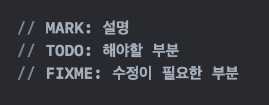
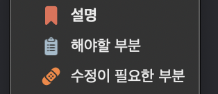

# 4장 주석

> 나쁜 코드에 주석을 달지 마라. 새로 짜라.  
    - 브라이언 W. 커니핸, P.J.플라우거

잘 달린 주석은 그 어떤 정보보다 유용하다. 하지만 오래되고 조잡한 주석은 거짓과 잘못된 정보를 퍼뜨려 해악을 미친다. 프로그래밍 언어를 사용해 의도를 표현할 능력이 있다면 주석은 전혀 필요하지 않으리라. 우리는 코드로 의도를 표현하지 못해, 즉 실패를 만회하기 위해 주석을 사용한다.  
**그러므로 주석이 필요한 상황에 처한다면, 상황을 역전해 코드로 의도를 표현할 방법에 대해 생각해야한다.**

주석은 오래될수록 코드에서 멀어진다. **코드는 변화하고 진화하지만 주석은 이를 따라가지 못한다.**  
프로그래머들은 주석을 관리해야할 것이 아니라, 코드를 깔끔하게 정리하고 표현력을 강화하는 쪽에 에너지를 쏟는 절도가 필요하다.  

**진실은 코드 한곳에서만 존재한다. 코드만이 자신이 하는 일을 진실되게 말한다.**
  
## 주석은 나쁜 코드를 보완하지 못한다.
코드에 주석을 추가하는 일반적인 이유는 코드 품질이 나쁘기 때문이다. 자신이 저지른 난장판(나쁜 코드)을 주석으로 설명하려 애쓰는 대신 그 난장판을 깨끗이 치우는 데 시간을 보내라!

## 코드로 의도를 표현하라!
코드만으로 의도를 설명하기 어려운 경우가 존재한다. 
불행히도 많은 개발자가 이를 코드가 훌륭한 수단이 아니라는 의미로 해석한다. 하지만 이것은 분명히 잘못된 생각이다.

```swift
// 직원에게 복지 혜택을 받을 자격이 있는지 검사한다.
if (employee.flags & HOURLY_FLAG) && employee.age > 65 { ... }

if employee.isEligibleForFullBenefits() { ... }

func isEligibleForFullBenefits() -> Bool {
    return (employee.flags & HOURLY_FLAG) && employee.age > 65
}
```
위의 두 조건문를 살펴보자. 많은 경우 **주석으로 달려는 설명을 함수로 만들어 표현해도 충분하다.**

## 좋은 주석
어떤 주석은 필요하거나 유익하다. 글자 값을 하는 주석 몇가지에 대해 정리해보자.  
하지만 명심하자. 정말로 좋은 주석은, 주석을 달지 않을 방법을 찾아내는 것이다.

### 법적인 주석
회사가 정립한 구현 표준에 맞춰 법적인 이유로 넣는 주석.  
다음과 같이, 각 소스 파일 첫머리에 주석으로 들어가는 저작권 정보와 소유권 정보는 필요하고 타당하다.
```swift
//
//  ViewController.swift
//  Project
//
//  Created by nahee on 10/31/22.
//
//  Copyright (c) 2022 nahee. All rights reserved.
```
### 정보를 제공하는 주석
기본적인 정보를 적어 편리를 제공하는 주석.
```swift
// 테스트 중인 Responder 인스턴스 반환
func responderInstance() -> Responder
```
가능하다면 다음과 같이 코드에 정보를 담는 편이 더 좋다.
```swift
func responderBeingTestedInstance() -> Responder
```

### 의도를 설명하는 주석
구현을 이해하게 도와주는 것을 넘어 결정에 깔린 의도까지 설명하는 주석.  

### 의미를 명료하게 밝히는 주석
인수나 반환값이 표준 라이브러리나 변경하지 못하는 코드에 속할때 (적절한 네이밍을 통해 해결할 수  없는 경우), 의미를 명료하게 밝히는 주석.  

### 결과를 경고하는 주석
다른 프로그래머에게 결과를 경고할 목적으로 사용하는 주석
```swift
// 여유 시간이 충분하지 않다면 실행하지 마십시오.
...

// 스레드에 안전하지 못하다.
// 따라서 각 인스턴스를 독립적으로 생성해야 한다.
...
```

### TODO 주석
앞으로 할일 및 현재 구현하지 않은 이유에 대한 주석.  
Xcode는 다음과 같이 TODO외에도 MARK, FIXME와 같은 주석들을 사용하여 파일 내의 탐색을 쉽게 만들어준다.  

   
해당 주석은 프로그래머가 필요하다 여기지만 당장 구현하기 어려운 업무를 기술한다. 다만 이것이 나쁜 코드를 남겨두는 핑계가 되어서는 안된다.

### 중요성을 강조하는 주석
대수롭지 않다고 여겨질 무언가의 중요성을 강조하기 위해 사용되는 주석.  
```swift
// 유저로부터 입력받을 값을 저장할 때 trim으로 앞뒤 공백을 제거해야 한다.
var inputText = textField.text.trimmingCharacters(in: .whitespaces)
```

## 나쁜 주석
대다수의 주석이 이 범주에 속한다. 좋지 않은 주석에 대해 정리해보자.

### 주절거리는 주석
저자(개발자) 자신만이 이해할 수 있는 주절거리는 식의 주석.


### 같은 이야기를 중복하는 주석
코드의 내용을 그대로 중복하는 주석으로 이는 코드보다 더 많은 정보를 제공하지 못하며 독자가 함수를 대충 이해하고 넘어가게 만든다.  
```swift
// Manager 구현
let manager: Manager = Manager()
```

### 오해할 여지가 있는 주석
'살짝 잘못된 정보'로 인해 오해할 여지가 있는 주석은 독자를 혼란에 빠뜨린다.

### 의무적으로 다는 주석
모든 변수에 의무적으로 다는 주석.  
이는 코드를 복잡하게 만들며 거짓말을 퍼뜨리고 혼동과 무질서를 초래한다.

### 이력을 기록하는 주석
모듈을 편집할 때마다 첫머리에 추가하는 주석.  
현재까지 해당 모듈에 대한 변경을 모두 기록하는 일종의 로그와 같은 역할로, 이는 소스 코드 관리 시스템이 존재하지 않았을 당시의 관례이다. 현재는 혼란만 가중시키기 때문에 완전히 제거해야한다.

### 있으나 마나 한 주석
당연한 사실을 언급하며 새로운 정보를 제공하지 못하는 주석.  
이는 지나친 참견이라 개발자가 주석을 무시하는 습관에 빠지게 하며, 코드만 변경되고 주석은 오래되어 거짓 주석을 만든다.
```swift
// 기본 생성자
init() {
    ...
}

// 월 중 일자
let dayOfMonth: Int
```

### 위치를 표시하는 주석
소스 파일에서 특정 위치를 표시하기 위해 배너의 기능을 하는 주석.  
```swift
// Actions /////////////////
```
위와 같은 주석은 가독성을 낮춘다. 특히 뒷부분에 슬래시로 이어지는 잡음은 제거하는 편이 좋다.  
배너의 기능을 이용하고 싶다면 좋은 주석에서 보았던 MARK, TODO, FIXME를 이용하는 편이 나아보인다.

### 닫는 괄호에 다는 주석
닫는 괄호에 다는 주석은 중첩이 심하고 장황한 함수라면 의미가 있을지도 모른다.  
하지만 우리가 선호하는 작고 캡슐화된 함수에는 잡음일 뿐이다. 그러므로 닫는 괄호에 주석을 달아야겠다는 생각이 든다면 대신에 함수를 줄이려 시도하자.
```swift
try {
  while 조건 {
    ...
  } // while
} // try
catch {
  ...
} // catch
```

### 공로를 돌리거나 저자를 표시하는 주석
소스 코드 관리 시스템을 통해 누가 언제 무엇을 추가했는지 알 수 있다. 따라서 이러한 주석을 통해 코드를 오염시킬 필요가 없다.
```swift
// nahee가 추가했음.
```

### 주석으로 처리한 코드
주석으로 처리된 코드는 이유가 있어 남겨놓았으리라 여겨져 다른 사람들이 지우기를 주저하게 된다. 따라서 쓸모 없는 코드가 점차 쌓여간다.  
소스 코드 관리 시스템이 없던 시절 이러한 코드는 유용했다. 하지만 현재는 우수한 소스 코드 관리 시스템이 우리를 대신에 코드를 기억해준다. 이제는 코드를 잃어버릴 염려는 없다. 그냥 삭제하라!

### HTML 주석
HTML 주석은 (주석을 읽기 쉬워야하는) IDE에서 조차 읽기 어렵다.

### 전역 정보
근처에 있는 코드에 대한 주석만 기술해야한다. 코드 일부에 주석을 달면서 시스템 전반의 정보를 기술하지 마라.

### 너무 많은 정보
주석에 흥미로운 역사나 관련 없는 정보를 장황하게 늘어놓지 마라. 이는 독자에게 불필요하며 불가사의한 정보일 뿐이다.

### 모호한 관계
독자가 주석과 코드를 읽어보고 무슨 소리인지 알기 위해서는 이 둘의 관계는 명백해야한다.
